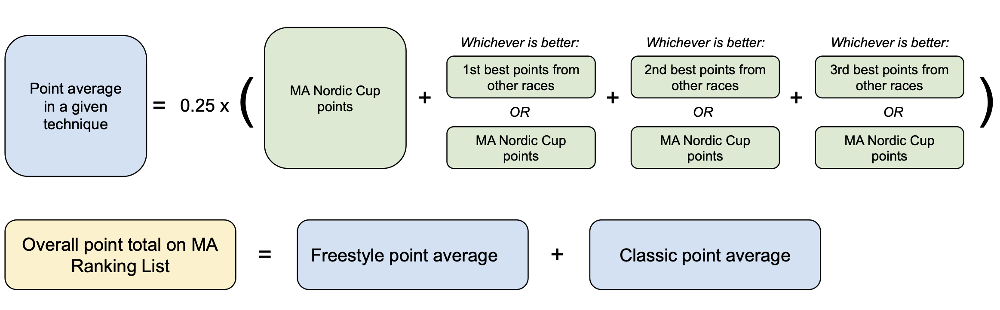

# MA Nordic Points for EHS & U16s Qualification

## Introduction & Overview

In the 2024-25 season, Massachusetts will adopt the MA Nordic Points system to select teams for the Eastern High School (EHS) and U16 Championships.

### Purpose of the MA Nordic Points System

The purpose of the points system is to create more objectivity and transparency in how athlete performance factors into championship team selection, while also rewarding athletes for strong performances in races outside of the MA Nordic Cup. The points system continues to emphasize the MA Nordic Cup's traditional role as a central component of team qualification.

### Key Components

**MA Nordic Cup**

* The day of racing previously known as the MA Qualifiers is now called the MA Nordic Cup.  
* As in previous years, only athletes who race in the MA Nordic Cup or receive a waiver to skip it may qualify for a championship team.

**Earning MA Nordic Points**

* Skiers may earn MA Nordic Points by racing in various race series and championships beyond the MA Nordic Cup, including high school league races, state championships, and Eastern Cups.

**Team Selection from MA Ranking List**

* The MA Ranking List will rank skiers by an aggregate of the points they earn over the course of the season.  
* Performance in the MA Nordic Cup is an important contributor to placement on the MA Ranking List.

**Objective and Discretionary Slots**

* Twenty skiers of each gender will be named to each championship team in order of placement on the MA Ranking List.  
* An additional four skiers of each gender may be named to each championship team at the discretion of the MA Nordic selection committee.

**Timeline**

* The MA Ranking List will be available online at massnordic.org starting after the MA Nordic Cup, and will be updated at least weekly.  
* Team selection and naming will be based on the final version of the MA Ranking List and will occur after the conclusion of the final Eastern Cup weekend.

## Eligibility

### Registering for the MA Nordic Cup

To qualify for the EHS or U16 Championship teams, skiers must register for and compete in the MA Nordic Cup. In specific cases, skiers may request a waiver to excuse their participation while remaining eligible for team selection.

### Requesting a Waiver

If a skier is unable to race in the MA Nordic Cup, they may still be eligible for team selection by obtaining a waiver. Waiver requests must be submitted in advance by the skier’s coach and may be granted for the following reasons:

1. **Illness or Injury** on the day of the event.  
2. **Family Commitments** that prevent participation *(Note: Other extracurricular activities generally do not qualify)*.  
3. **Junior Nationals Qualification** expectations, if:  
   * The athlete would qualify for the New England Junior National team as a U18/U20 based on the NENSA Junior Ranking List (JRL) on the day of the MA Nordic Cup.  
   * The athlete is "on the bubble," meaning they are among the top three remaining Massachusetts skiers on the U18/U20 JRL after excluding those who would already qualify for Junior Nationals.

**Submitting a waiver request does not guarantee the athlete a spot on a team.** The Mass Nordic Committee will review all requests promptly and inform the athlete and their coach of the decision. 

### How to Qualify with an Approved Waiver

Skiers with approved waivers may be selected for a championship team on either objective criteria (via the MA Ranking List) or discretionary grounds, depending on the other races they have entered. 

* Skiers who have earned points from at least one classic and one skate race among the list of points-eligible events will be included on the MA Ranking List and eligible for selection based on their ranking on the list. *Note: In the 2024-25 season, the only classic races open to all MA athletes, apart from the MA Nordic Cup, are on the Eastern Cup circuit.*  
* Skiers who have not earned both classic and skate points in the season will not be included on the MA Ranking List and can only be considered for team selection through a discretionary pick by the MA Nordic Committee.

## Earning Points

### Which Races Earn Points

MA Nordic Points may be earned at any of the following races and race series[^1]:

1. MA Nordic Cup  
2. Varsity high school league races (MA Bay East, MA Bay West, Berkshire, Lake Region)  
3. State Championships (MIAA & NEPSAC)  
4. Eastern Cups

[^1]: It is assumed that the field of MA skiers in each points-eligible race is sufficiently large. For points to be awarded, a gender-age category (e.g., “U18 Girls”) of a points-eligible race must include at least three finishers who have all 1) registered for the MA Nordic Cup for the current season and 2) finished at least one additional points-eligible race in the preceding 12 months.

### Who Earns Points

All high school and U16 skiers registered for the MA Nordic Cup in a given season earn MA Nordic Points for their racing in that season.

### When Points Are Calculated

The MA Ranking List will be maintained and updated beginning after the MA Nordic Cup and ending shortly after the final Eastern Cup weekend. During this period, the most recent MA Ranking List will be available for review at massnordic.org.

Points are calculated for all points-eligible races a skier has finished in the current season, including retroactively for points-eligible races that occurred before the MA Nordic Cup.

### How Points Are Calculated

Any registered skier who finishes a points-eligible race earns points in that race. Lower points indicate better performances. A skier’s points from a race depend on two factors:

1. The *race penalty,* which reflects the strength of the field, determines the top MA finisher’s points. The *race penalty* is calculated using a statistical procedure based on past results from the top 5 Massachusetts finishers in the race. Stronger fields yield lower *race penalties*.  
2. Points for other racers are determined via their *fractional time back* from the top MA finisher (the ratio of the skier’s time to the top MA finisher’s time). A skier’s points are awarded in direct proportion to their *fractional time back* from the top MA finisher.

*Example*: If the race penalty of a points-eligible race is 100, then the top MA finisher would score 100 points, and a skier whose time is 5% back from that of the top MA finisher would score 105 points.

## Team Selection

### Calculation of the MA Ranking List

Points are calculated separately for **classic** and **skate** races, and then the classic average and skate average are added together to form a skier’s overall points total. The formula is the same for each technique.

---

#### If the skier raced in the MA Nordic Cup in a given technique:

1. **MA Nordic Cup points are always included** in the final calculation and form a ceiling for the skier's point average in that technique.
2. Up to **three additional eligible races** with better points than the skier’s MA Nordic Cup points may additionally be included.
3. MA Nordic Cup points are used as placeholders if the skier doesn’t have other eligible races with better points.
4. The **average of these four numbers**—MA Nordic Cup points and the three best other scores (or placeholders)—determines the skier’s overall point average for that technique.

**Note:** No further racing beyond the MA Nordic Cup skate and classic events is required to be named to a championship team.

#### If the skier did not race in the MA Nordic Cup in a given technique:

1. The skier must have an **approved waiver** to skip the MA Nordic Cup in that technique.
2. The skier’s final score is determined by averaging:
   - The **best three races** among other eligible events of that technique, or  
   - **As many eligible races as the skier has completed**, if fewer than three.
3. If a skier has not finished at least one eligible race in each technique, they will **not** appear on the final ranking list.

{: .highlight }
**Note**: At least one classic and one skate race must be completed for inclusion in the ranking list. If a skier does not have enough qualifying results, their only route onto a championship team is via a discretionary pick.

### Naming a Team

For each championship team, twenty slots of each gender will be filled in order of placement on the MA Ranking List. If a skier declines one of these slots, that slot will be offered to the next eligible skier on the ranking list.

Up to four team slots of each gender will be filled at the discretion of the MA Nordic Committee.

## For Coaches

### How Do I Submit Race Results for Entry into the MA Nordic Results Database?

After each race, email the results as an attachment to [**massnordic@emxc.org**](mailto:massnordic@emxc.org). 

### How Do I Submit a Waiver on Behalf of an Athlete Who Will Not Be Competing in the MA Qualifier?

Waiver requests must be submitted by coaches prior to the MA Nordic Cup. Submitting a waiver does not guarantee the athlete a spot on a team. For more details, see the “Eligibility” section above.

* [**Link to Waiver Submission**](https://forms.gle/ehNjhQrhFPsjHrUc9). Coaches should complete one Google Form for each athlete.
